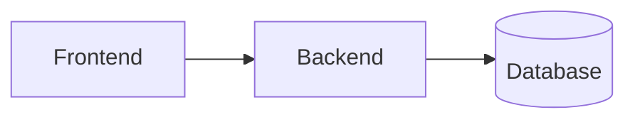
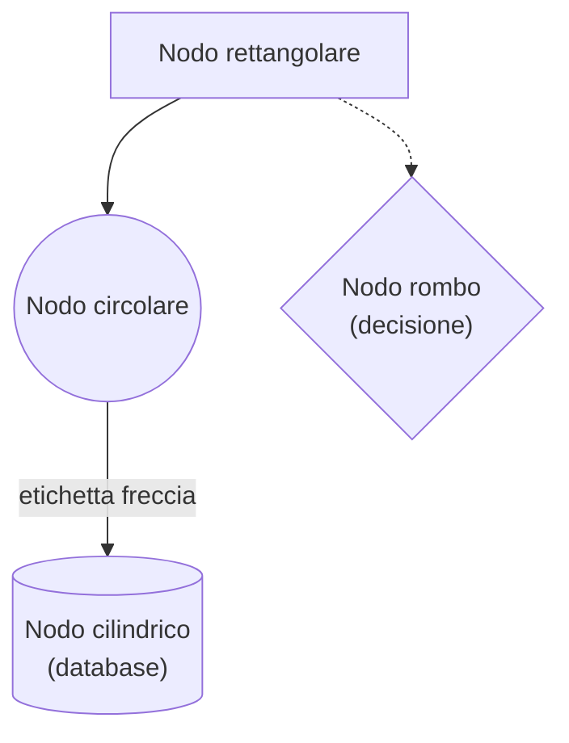
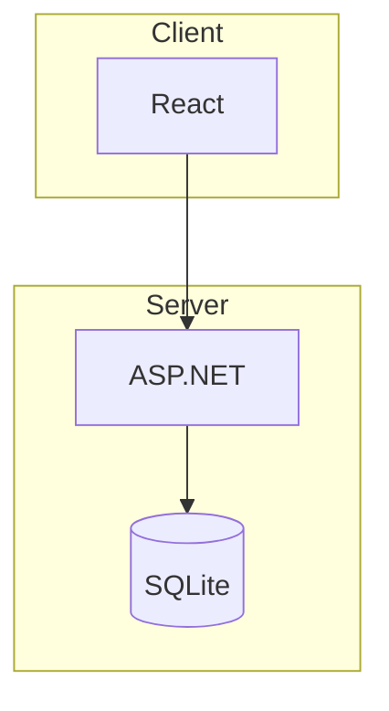
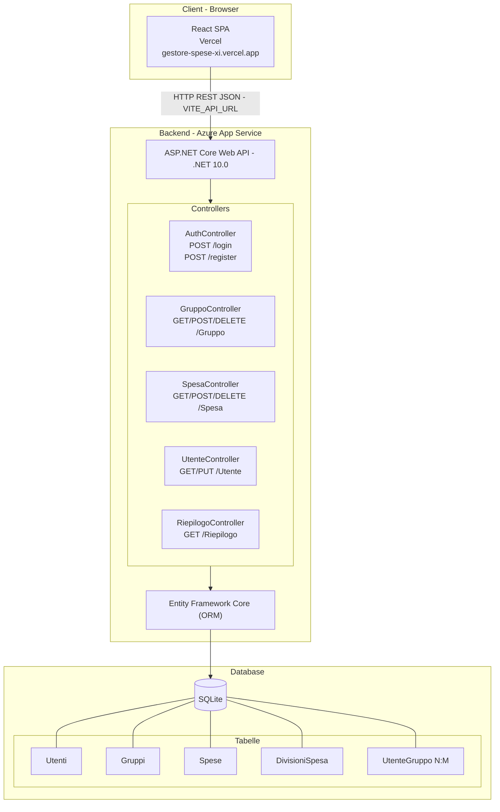
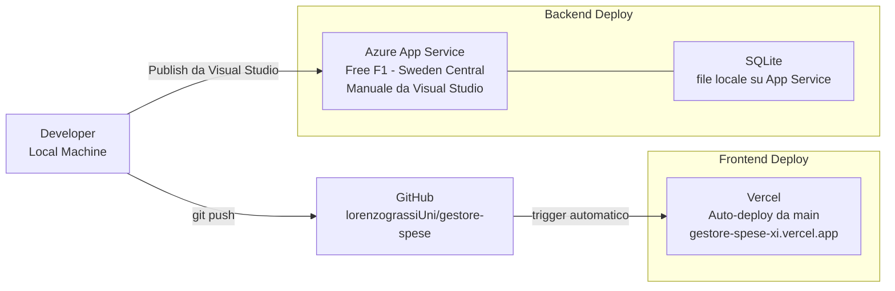
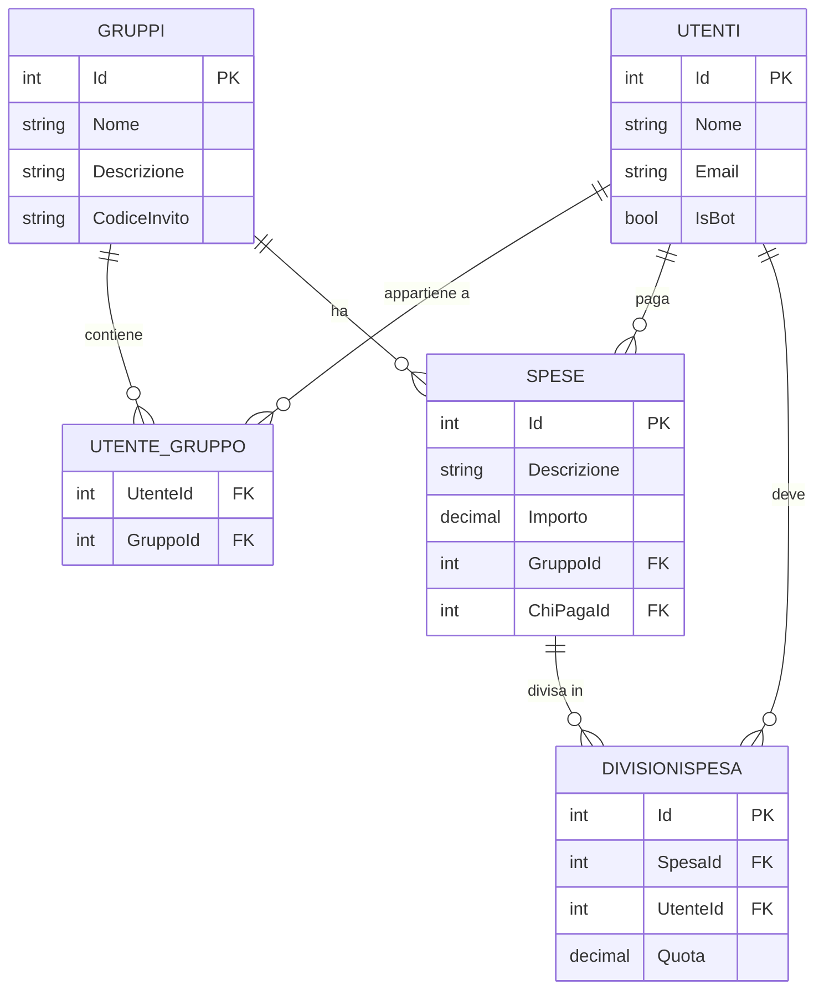

# Capitolo 14 — Diagrammi e Documentazione

In questo capitolo spieghiamo cos'è Mermaid, come funziona la sintassi dei suoi diagrammi, e analizziamo i tre diagrammi presenti nel file `docs/architettura.md` del progetto: l'architettura generale, il flusso di deploy e lo schema ER del database.

---

## 14.1 Mermaid — Diagrammi come Codice

### Cos'è Mermaid

**Mermaid** è un linguaggio testuale per creare diagrammi. Invece di usare strumenti visuali come draw.io o Lucidchart, si scrive il diagramma come testo e Mermaid lo renderizza automaticamente in un'immagine vettoriale.

Il vantaggio principale è che i diagrammi vivono **nel codice sorgente** (file `.md` su Git), quindi:
- Sono versionati insieme al codice
- Si aggiornano con una modifica al testo, non ridisegnando
- Sono leggibili anche senza rendering (come testo)

### Supporto in GitHub

GitHub renderizza automaticamente i blocchi Mermaid nei file Markdown:

````markdown

````

Questo blocco viene mostrato come un diagramma grafico nella pagina del repository, senza installare nulla.

### Tipi di Diagramma Mermaid

| Tipo | Parola chiave | Uso |
|------|--------------|-----|
| Grafo | `graph` / `flowchart` | Flussi, architetture, decisioni |
| Diagramma ER | `erDiagram` | Schemi database, relazioni tra entità |
| Diagramma di sequenza | `sequenceDiagram` | Flussi di comunicazione tra sistemi |
| Diagramma di classe | `classDiagram` | Struttura OOP, ereditarietà |
| Diagramma Gantt | `gantt` | Pianificazione, timeline |
| Diagramma a torta | `pie` | Proporzioni |

Nel progetto usiamo `graph TB`, `graph LR` e `erDiagram`.

### Sintassi Base: Grafi (`graph`)



| Sintassi | Forma | Uso tipico |
|----------|-------|------------|
| `["testo"]` | Rettangolo | Componente generico |
| `(("testo"))` | Cerchio | Evento, stato |
| `[("testo")]` | Cilindro | Database, storage |
| `{"testo"}` | Rombo | Decisione, condizione |
| `-->` | Freccia solida | Flusso principale |
| `-- "label" -->` | Freccia con etichetta | Flusso con descrizione |
| `-.->` | Freccia tratteggiata | Flusso secondario/opzionale |
| `---` | Linea senza freccia | Associazione |

### Direzione del Grafo

| Codice | Significato | Lettura |
|--------|-------------|--------|
| `graph TB` | Top to Bottom | Dall'alto verso il basso |
| `graph LR` | Left to Right | Da sinistra a destra |
| `graph RL` | Right to Left | Da destra a sinistra |
| `graph BT` | Bottom to Top | Dal basso verso l'alto |

### Sottografi (`subgraph`)

Permettono di raggruppare nodi correlati in "riquadri" etichettati:



---

## 14.2 Diagramma Architettura Generale

Ecco il diagramma presente in `docs/architettura.md` con spiegazione di ogni elemento:



### Lettura del Diagramma

Il diagramma usa `graph TB` (Top to Bottom) con tre `subgraph` annidati che rappresentano i tre livelli fisici del sistema:

```
┌─────────────────────────┐
│  CLIENT (browser/Vercel)   │  ← dove gira il codice React
└─────────────────────────┘
           │ HTTP REST JSON
           │ (VITE_API_URL)
┌─────────────────────────┐
│  BACKEND (Azure App Service)│  ← dove gira ASP.NET Core
│  API → Controllers → EF    │
└─────────────────────────┘
           │ query SQL
           │ (tramite EF Core)
┌─────────────────────────┐
│  DATABASE (SQLite file)     │  ← file .db su disco Azure
│  5 tabelle relazionali      │
└─────────────────────────┘
```

### Elementi Notevoli

- **`UI -- "HTTP REST JSON - VITE_API_URL" --> API`** — la freccia con etichetta evidenzia sia il protocollo (HTTP REST) che il formato dei dati (JSON) e il modo in cui il frontend conosce l'URL del backend (variabile d'ambiente `VITE_API_URL`)
- **Subgraph annidati** — `CONTROLLERS` è un subgraph dentro `BACKEND`: questo mostra visivamente che i controller sono un componente interno al backend, non un layer separato
- **`SQLITE --- T1 & T2 & T3 & T4 & T5`** — la sintassi `&` connette un nodo a più nodi in una sola riga, equivalente a scrivere 5 righe separate
- **Forma cilindrica** `[("SQLite")]` — la notazione standard per i database in Mermaid

---

## 14.3 Diagramma Flusso Deploy



### Lettura del Diagramma

Il diagramma usa `graph LR` (Left to Right) per enfatizzare il **flusso temporale**: da sinistra (azione del developer) verso destra (sistemi in produzione).

Si distinguono due percorsi di deploy:

**Percorso Frontend (automatico):**
```
Developer
    │
    │ git push
    ↓
  GitHub (main)
    │
    │ trigger automatico (webhook Vercel)
    ↓
  Vercel → build React → CDN globale
```

**Percorso Backend (manuale):**
```
Developer
    │
    │ "Publish" da Visual Studio
    ↓
  Azure App Service
    │
    │ file locale su disco
    ↓
  SQLite (.db)
```

### Perché il Backend è Deploy Manuale?

Il backend su Azure App Service Free F1 viene deployato manualmente tramite il wizard "Publish" di Visual Studio, invece che automaticamente. Questo è comune in progetti universitari per tre motivi:

1. Il tier gratuito di Azure non supporta facilmente CD con GitHub Actions senza configurare credenziali di servizio
2. Il database SQLite è un **file locale** su Azure (`C:\home\data\database.db`), non un database cloud — un CD automatico rischierebbe di sovrascriverlo
3. Le modifiche al backend sono meno frequenti rispetto al frontend

---

## 14.4 Schema ER con Mermaid

### Sintassi `erDiagram`

Mermaid supporta i diagrammi **Entity-Relationship** (ER) con la parola chiave `erDiagram`. La struttura è:

```
erDiagram
    ENTITA {
        tipo NomeAttributo ["PK"|"FK"]
    }
    ENTITA1 ||--o{ ENTITA2 : "descrizione"
```

### Notazione delle Relazioni

La cardinalità usa una notazione visiva composta da simboli concatenati:

| Simbolo | Significato |
|---------|-------------|
| `\|\|` | Esattamente uno (1) |
| `o\|` | Zero o uno (0..1) |
| `\|{` | Uno o più (1..N) |
| `o{` | Zero o più (0..N) |

Combinando i due lati:

| Notazione Mermaid | Cardinalità | Lettura |
|-------------------|-------------|--------|
| `\|\|--\|\|` | 1 a 1 | Un record è associato a esattamente un altro |
| `\|\|--o{` | 1 a N | Un record può avere zero o più figli |
| `o{--o{` | N a M | Molti a molti (richiede tabella ponte) |

### Il Diagramma ER del Progetto



### Lettura delle Relazioni

| Relazione Mermaid | Lettura in italiano |
|-------------------|---------------------|
| `UTENTI \|\|--o{ UTENTE_GRUPPO` | Un utente può appartenere a zero o più gruppi |
| `GRUPPI \|\|--o{ UTENTE_GRUPPO` | Un gruppo contiene zero o più utenti |
| `GRUPPI \|\|--o{ SPESE` | Un gruppo ha zero o più spese |
| `UTENTI \|\|--o{ SPESE` | Un utente può aver pagato zero o più spese |
| `SPESE \|\|--o{ DIVISIONISPESA` | Una spesa è divisa in una o più quote |
| `UTENTI \|\|--o{ DIVISIONISPESA` | Un utente può essere coinvolto in zero o più divisioni |

### Struttura N:M e Tabella Ponte

La relazione tra `UTENTI` e `GRUPPI` è **molti-a-molti**: un utente può essere in più gruppi e un gruppo può avere più utenti. Nei database relazionali una N:M non può essere rappresentata direttamente: richiede una **tabella ponte** (`UTENTE_GRUPPO`) che memorizza le coppie (UtenteId, GruppoId).

```
UTENTI          UTENTE_GRUPPO       GRUPPI
┌─────┐          ┌────────────┐         ┌──────┐
│Id=1 │ 1      N │UtenteId=1  │ N      1 │Id=10 │
│Marco├──────────│GruppoId=10 ├────────│Vacanze│
└─────┘          ├────────────│         └──────┘
┌─────┐          │UtenteId=1  │
│Id=2 │ 1      N │GruppoId=11 │ N      1 ┌──────┐
│Sara ├──────────│UtenteId=2  ├────────│Casa  │
└─────┘          │GruppoId=10 │         └──────┘
                   └────────────┘

 Marco è in 2 gruppi (Vacanze + Casa)
 Sara è in 1 gruppo (Vacanze)
```

### Attributo `IsBot`

Il campo `IsBot` su `UTENTI` non compare nel diagramma Mermaid con annotazioni particolari, ma è fondamentale per distinguere:
- **Utenti reali** (`IsBot = false`): possono fare login, hanno email reale
- **Utenti bot** (`IsBot = true`): aggiunti manualmente da `DettaglioGruppo`, hanno email generata `@bot.it`, non possono autenticarsi

---

## Riepilogo: I 3 Diagrammi del Progetto

| Diagramma | Tipo Mermaid | Direzione | Mostra |
|-----------|-------------|-----------|--------|
| Architettura Generale | `graph TB` | Top→Bottom | Stack tecnologico e flusso dati a runtime |
| Flusso Deploy | `graph LR` | Left→Right | Chi fa cosa per mettere in produzione |
| Schema ER | `erDiagram` | — | Entità, attributi e relazioni del database |

I tre diagrammi sono **complementari**: il primo risponde a "come funziona?", il secondo a "come si deploya?", il terzo a "come sono fatti i dati?".
