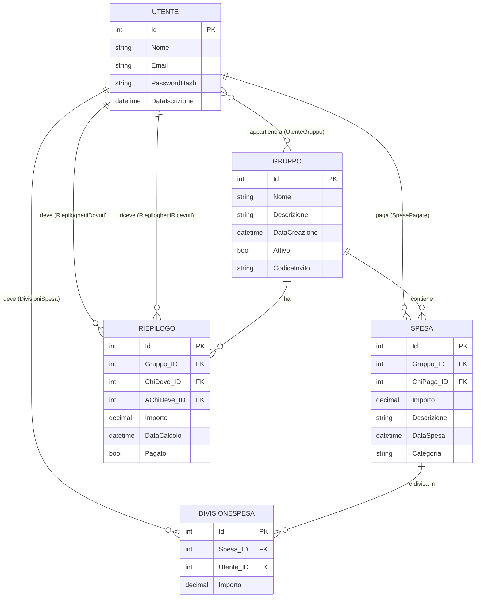

# Capitolo 6 — Modellazione dei Dati

> Questo capitolo descrive la struttura del database di Gestore Spese: le entità, le relazioni tra di esse, la configurazione di Entity Framework Core e il ciclo di vita delle migrazioni. È la spina dorsale del backend — tutto il resto (controller, API, calcoli) poggia su questo schema.

---

## 6.1 Schema ER Completo

Il diagramma seguente rappresenta le **5 entità** del database e le relazioni tra di esse. È generato con **Mermaid**, lo strumento di diagrammazione-come-codice integrato in GitHub (ne parleremo nel Capitolo 14).



La tabella **UtenteGruppo** non è un'entità C# esplicita — è generata automaticamente da EF Core come **tabella di join** per la relazione N:M tra `Utente` e `Gruppo` (vedi §6.3).

---

## 6.2 Le 5 Entità

### Utente

```csharp
public class Utente
{
    [Key]
    public int Id { get; set; }

    [Required(ErrorMessage = "Il nome è obbligatorio")]
    [StringLength(100)]
    public string? Nome { get; set; }

    [Required(ErrorMessage = "L'email è obbligatoria")]
    [EmailAddress]
    public string? Email { get; set; }

    public string? PasswordHash { get; set; }

    public DateTime DataIscrizione { get; set; } = DateTime.Now;

    // Navigation properties
    public virtual ICollection<Gruppo> Gruppi { get; set; } = new List<Gruppo>();
    public virtual ICollection<Spesa> SpesePagate { get; set; } = new List<Spesa>();
    public virtual ICollection<DivisioneSpesa> DivisioniSpesa { get; set; } = new List<DivisioneSpesa>();
    public virtual ICollection<Riepilogo> RiepiloghettiDovuti { get; set; } = new List<Riepilogo>();
    public virtual ICollection<Riepilogo> RiepiloghettiRicevuti { get; set; } = new List<Riepilogo>();
}
```

**Punti chiave:**

- `[Key]` — Data Annotation che indica ad EF Core la chiave primaria. EF Core la mapperà come colonna `INTEGER PRIMARY KEY AUTOINCREMENT` in SQLite.
- `[Required]` e `[StringLength]` — validazioni dichiarative. ASP.NET Core le controlla automaticamente prima di arrivare al controller (attraverso `ModelState.IsValid`).
- `[EmailAddress]` — valida il formato email tramite regex interna a .NET.
- `PasswordHash` è nullable (`string?`) perché nella logica di **Auto-Provisioning** (vedi Capitolo 7) un utente può esistere senza password se viene aggiunto a un gruppo da qualcun altro.
- Le **cinque navigation properties** (`Gruppi`, `SpesePagate`, `DivisioniSpesa`, `RiepiloghettiDovuti`, `RiepiloghettiRicevuti`) permettono ad EF Core di fare JOIN automatici tramite `Include()` nelle query LINQ.
- Il doppio `RiepiloghettiDovuti` / `RiepiloghettiRicevuti` è necessario perché `Riepilogo` ha **due FK verso Utente** (chi deve e a chi deve) — EF Core non può disambiguare automaticamente, quindi usiamo navigation properties esplicite su entrambi i lati (configurate in `OnModelCreating`).

---

### Gruppo

```csharp
public class Gruppo
{
    [Key]
    public int Id { get; set; }

    [Required(ErrorMessage = "Il nome del gruppo è obbligatorio")]
    [StringLength(100)]
    public string? Nome { get; set; }

    [StringLength(500)]
    public string? Descrizione { get; set; }

    public DateTime DataCreazione { get; set; } = DateTime.Now;

    public bool Attivo { get; set; } = true;

    [StringLength(10)]
    public string CodiceInvito { get; set; } = Guid.NewGuid().ToString("N").Substring(0, 8).ToUpper();

    // Navigation properties
    public virtual ICollection<Utente> Utenti { get; set; } = new List<Utente>();
    public virtual ICollection<Spesa> Spese { get; set; } = new List<Spesa>();
    public virtual ICollection<Riepilogo> Riepiloghetti { get; set; } = new List<Riepilogo>();
}
```

**Punti chiave:**

- `CodiceInvito` — generato in-place con `Guid.NewGuid()`: crea un UUID v4, lo converte in stringa esadecimale senza trattini (`"N"`), prende gli 8 caratteri iniziali e li converte in maiuscolo. Risultato: un codice come `"A3F8C12E"`, unico e facile da comunicare verbalmente.
- `Attivo` — flag soft-delete: invece di cancellare fisicamente il gruppo dal DB (con potenziale perdita di dati storici), lo si marca come inattivo. È una best practice nei sistemi di gestione finanziaria.
- La navigation property `Utenti` è il lato "molti" della relazione N:M con `Utente` — EF Core crea automaticamente la tabella `UtenteGruppo` come tabella di join (vedi §6.3).

---

### Spesa

```csharp
public class Spesa
{
    [Key]
    public int Id { get; set; }

    [ForeignKey("Gruppo")]
    public int Gruppo_ID { get; set; }

    [ForeignKey("UtenteChePaga")]
    public int ChiPaga_ID { get; set; }

    [Required(ErrorMessage = "L'importo è obbligatorio")]
    [Range(0.01, double.MaxValue, ErrorMessage = "L'importo deve essere maggiore di 0")]
    [Column(TypeName = "decimal(10, 2)")]
    public decimal Importo { get; set; }

    [StringLength(200)]
    public string? Descrizione { get; set; }

    public DateTime DataSpesa { get; set; } = DateTime.Now;

    [StringLength(50)]
    public string? Categoria { get; set; }

    // Navigation properties
    public virtual Gruppo? Gruppo { get; set; }
    public virtual Utente? UtenteChePaga { get; set; }
    public virtual ICollection<DivisioneSpesa> Divisioni { get; set; } = new List<DivisioneSpesa>();
}
```

**Punti chiave:**

- `[ForeignKey("NomeNavigationProperty")]` — indica ad EF Core quale navigation property è associata alla FK. Senza questa annotazione, EF Core dovrebbe indovinare la relazione dal nome, il che può portare ad ambiguità.
- `[Column(TypeName = "decimal(10, 2)")]` — fondamentale per i soldi! Senza questa annotazione, SQLite userebbe `REAL` (floating point), che introduce errori di arrotondamento su operazioni finanziarie (es. `0.1 + 0.2 = 0.30000000000000004`). `decimal(10,2)` garantisce precisione fino a 2 cifre decimali.
- `[Range(0.01, double.MaxValue)]` — impedisce spese con importo zero o negativo a livello di model, prima ancora che il controller validi i dati.
- `Categoria` è nullable — è un campo facoltativo per categorizzare la spesa (es. "Cibo", "Trasporti", "Alloggio").

---

### DivisioneSpesa

```csharp
public class DivisioneSpesa
{
    [Key]
    public int Id { get; set; }

    [ForeignKey("Spesa")]
    public int Spesa_ID { get; set; }

    [ForeignKey("Utente")]
    public int Utente_ID { get; set; }

    [Required]
    [Column(TypeName = "decimal(10, 2)")]
    public decimal Importo { get; set; }

    public virtual Spesa? Spesa { get; set; }
    public virtual Utente? Utente { get; set; }
}
```

**Ruolo nell'applicazione:**

`DivisioneSpesa` è la **tabella di distribuzione del costo**. Per ogni `Spesa`, esistono tante righe `DivisioneSpesa` quanti sono i partecipanti alla spesa. Esempio:

```
Spesa ID=42: "Cena", Importo=90€, pagata da Mario

→ DivisioneSpesa: Spesa_ID=42, Utente_ID=1 (Mario),  Importo=30€
→ DivisioneSpesa: Spesa_ID=42, Utente_ID=2 (Luigi),  Importo=30€
→ DivisioneSpesa: Spesa_ID=42, Utente_ID=3 (Peach),  Importo=30€
```

Questo design consente divisioni **non uniformi**: ogni utente può avere una quota diversa. La somma degli `Importo` nelle righe `DivisioneSpesa` deve corrispondere all'`Importo` della `Spesa` padre.

> **Relazione con DeleteBehavior**: quando una `Spesa` viene eliminata, le sue `DivisioneSpesa` vengono eliminate a cascata (`OnDelete(DeleteBehavior.Cascade)`). Questo è logicamente corretto: una divisione senza la spesa padre non ha senso.

---

### Riepilogo

```csharp
public class Riepilogo
{
    [Key]
    public int Id { get; set; }

    [ForeignKey("Gruppo")]
    public int Gruppo_ID { get; set; }

    [ForeignKey("UtenteCheDeve")]
    public int ChiDeve_ID { get; set; }

    [ForeignKey("UtenteACuiDeve")]
    public int AChiDeve_ID { get; set; }

    [Column(TypeName = "decimal(10, 2)")]
    public decimal Importo { get; set; }

    public DateTime DataCalcolo { get; set; } = DateTime.Now;

    public bool Pagato { get; set; } = false;

    public virtual Gruppo? Gruppo { get; set; }
    public virtual Utente? UtenteCheDeve { get; set; }
    public virtual Utente? UtenteACuiDeve { get; set; }
}
```

**Ruolo nell'applicazione:**

`Riepilogo` rappresenta un **debito calcolato** tra due utenti all'interno di un gruppo. Viene popolato dal `RiepilogoController` quando l'utente richiede il calcolo dei saldi (vedi Capitolo 7). Esempio:

```
Riepilogo ID=5:
  Gruppo_ID=3 (Vacanza 2026)
  ChiDeve_ID=2 (Luigi deve)
  AChiDeve_ID=1 (a Mario)
  Importo=45.50€
  Pagato=false
```

Quando Luigi salda il debito, il flag `Pagato` diventa `true` — il record non viene cancellato (storico dei pagamenti).

> **Doppia FK su Utente**: avere sia `ChiDeve_ID` che `AChiDeve_ID` come FK verso la stessa tabella `Utente` crea un'**ambiguità di relazione** che EF Core non può risolvere automaticamente. La configurazione in `OnModelCreating` è obbligatoria (vedi §6.4).

---

## 6.3 Relazioni: 1:N, N:M, DeleteBehavior

Le relazioni nel database di Gestore Spese sono di tre tipi:

### Relazione N:M — Utente ↔ Gruppo

Un utente può appartenere a più gruppi, e un gruppo può avere più utenti. Questa è la classica relazione **Many-to-Many**.

```csharp
// In OnModelCreating:
modelBuilder.Entity<Utente>()
    .HasMany(u => u.Gruppi)
    .WithMany(g => g.Utenti)
    .UsingEntity(j => j.ToTable("UtenteGruppo"));
```

EF Core crea automaticamente la tabella di join `UtenteGruppo` con due colonne FK:

```
Tabella UtenteGruppo (generata da EF Core):
┌──────────────┬──────────────┐
│  Utenti_Id   │  Gruppi_Id   │
├──────────────┼──────────────┤
│      1       │      3       │  ← Mario è nel gruppo Vacanza
│      2       │      3       │  ← Luigi è nel gruppo Vacanza
│      1       │      7       │  ← Mario è anche nel gruppo Lavoro
└──────────────┴──────────────┘
```

### Relazioni 1:N — Le Altre

| Relazione | Cardinalità | DeleteBehavior | Motivazione |
|-----------|-------------|----------------|-------------|
| Gruppo → Spese | 1:N | `Restrict` | Non si può cancellare un gruppo con spese attive |
| Utente → SpesePagate | 1:N | `Restrict` | Non si può cancellare un utente con spese registrate |
| Spesa → DivisioniSpesa | 1:N | **`Cascade`** | Cancellando una spesa, le sue divisioni vengono eliminate automaticamente |
| Utente → DivisioniSpesa | 1:N | `Restrict` | Non si può cancellare un utente con divisioni attive |
| Gruppo → Riepiloghi | 1:N | `Restrict` | Non si può cancellare un gruppo con debiti non saldati |
| Utente → RiepiloghettiDovuti | 1:N | `Restrict` | Non si può cancellare un utente che deve ancora dei soldi |
| Utente → RiepiloghettiRicevuti | 1:N | `Restrict` | Non si può cancellare un utente a cui devono ancora dei soldi |

**`DeleteBehavior.Restrict` vs `DeleteBehavior.Cascade`:**

- **`Cascade`**: quando il record padre viene eliminato, tutti i figli vengono eliminati automaticamente. Usato per `DivisioneSpesa` perché non ha senso una divisione senza la spesa padre.
- **`Restrict`**: impedisce la cancellazione del padre se esistono figli. Usato per quasi tutte le altre relazioni: non puoi eliminare un gruppo finché ha spese, non puoi eliminare un utente finché ha debiti — questo protegge l'integrità dei dati finanziari.

> **Perché non `SetNull`?** `SetNull` metterebbe la FK a `NULL` quando il padre viene eliminato. Per i dati finanziari non è accettabile: una spesa senza un gruppo o senza chi l'ha pagata è un dato corrotto.

---

## 6.4 ApplicationDbContext e OnModelCreating

`ApplicationDbContext` è il **cuore di EF Core** — è la classe che rappresenta la sessione con il database. Ogni operazione CRUD passa attraverso di essa.

```csharp
public class ApplicationDbContext : DbContext
{
    public ApplicationDbContext(DbContextOptions<ApplicationDbContext> options)
        : base(options)
    {
    }

    // I DbSet sono le "tabelle" accessibili via LINQ
    public DbSet<Gruppo> Gruppi { get; set; }
    public DbSet<Utente> Utenti { get; set; }
    public DbSet<Spesa> Spese { get; set; }
    public DbSet<DivisioneSpesa> Divisioni { get; set; }
    public DbSet<Riepilogo> Riepiloghi { get; set; }

    protected override void OnModelCreating(ModelBuilder modelBuilder)
    {
        base.OnModelCreating(modelBuilder);

        // N:M Utente ↔ Gruppo
        modelBuilder.Entity<Utente>()
            .HasMany(u => u.Gruppi)
            .WithMany(g => g.Utenti)
            .UsingEntity(j => j.ToTable("UtenteGruppo"));

        // 1:N Spesa → Gruppo (Restrict)
        modelBuilder.Entity<Spesa>()
            .HasOne(s => s.Gruppo)
            .WithMany(g => g.Spese)
            .HasForeignKey(s => s.Gruppo_ID)
            .OnDelete(DeleteBehavior.Restrict);

        // 1:N Spesa → Utente (chi paga, Restrict)
        modelBuilder.Entity<Spesa>()
            .HasOne(s => s.UtenteChePaga)
            .WithMany(u => u.SpesePagate)
            .HasForeignKey(s => s.ChiPaga_ID)
            .OnDelete(DeleteBehavior.Restrict);

        // 1:N DivisioneSpesa → Spesa (Cascade!)
        modelBuilder.Entity<DivisioneSpesa>()
            .HasOne(d => d.Spesa)
            .WithMany(s => s.Divisioni)
            .HasForeignKey(d => d.Spesa_ID)
            .OnDelete(DeleteBehavior.Cascade);

        // 1:N DivisioneSpesa → Utente (Restrict)
        modelBuilder.Entity<DivisioneSpesa>()
            .HasOne(d => d.Utente)
            .WithMany(u => u.DivisioniSpesa)
            .HasForeignKey(d => d.Utente_ID)
            .OnDelete(DeleteBehavior.Restrict);

        // 1:N Riepilogo → Gruppo (Restrict)
        modelBuilder.Entity<Riepilogo>()
            .HasOne(r => r.Gruppo)
            .WithMany(g => g.Riepiloghetti)
            .HasForeignKey(r => r.Gruppo_ID)
            .OnDelete(DeleteBehavior.Restrict);

        // 1:N Riepilogo → Utente (chi deve, Restrict)
        modelBuilder.Entity<Riepilogo>()
            .HasOne(r => r.UtenteCheDeve)
            .WithMany(u => u.RiepiloghettiDovuti)
            .HasForeignKey(r => r.ChiDeve_ID)
            .OnDelete(DeleteBehavior.Restrict);

        // 1:N Riepilogo → Utente (a chi deve, Restrict)
        modelBuilder.Entity<Riepilogo>()
            .HasOne(r => r.UtenteACuiDeve)
            .WithMany(u => u.RiepiloghettiRicevuti)
            .HasForeignKey(r => r.AChiDeve_ID)
            .OnDelete(DeleteBehavior.Restrict);
    }
}
```

### Come viene iniettato

`ApplicationDbContext` non viene mai istanziato manualmente — è registrato nel **Dependency Injection container** di ASP.NET Core in `Program.cs`:

```csharp
// Program.cs
builder.Services.AddDbContext<ApplicationDbContext>(options =>
    options.UseSqlite(builder.Configuration.GetConnectionString("DefaultConnection")));
```

ASP.NET Core crea automaticamente un'istanza di `ApplicationDbContext` per ogni richiesta HTTP, la inietta nei controller che ne hanno bisogno, e la distrugge alla fine della richiesta. Questo è il pattern **Scoped Lifetime** del DI container.

### DbSet — cosa sono in pratica

Ogni `DbSet<T>` è una **query IQueryable** verso la tabella corrispondente. Non contiene dati in memoria — è solo un gateway per costruire query LINQ che vengono tradotte in SQL:

```csharp
// Questo non esegue nessuna query SQL ancora:
var query = _context.Utenti.Where(u => u.Email == "mario@example.com");

// Solo qui viene eseguita la SELECT e i dati vengono caricati:
var utente = await query.FirstOrDefaultAsync();
// → SELECT TOP 1 * FROM Utenti WHERE Email = 'mario@example.com'
```

---

## 6.5 Migrazioni EF Core

Le **migrazioni** sono il meccanismo con cui EF Core sincronizza il modello C# con lo schema fisico del database. Ogni migrazione è uno snapshot delle differenze tra lo stato attuale del modello e lo stato precedente.

### La nostra migrazione: `MigrazioneDefinitiva`

Il progetto ha una singola migrazione: `20260319171711_MigrazioneDefinitiva` (timestamp: 19 marzo 2026 alle 17:17:11). Il nome del file è `20260319171711_MigrazioneDefinitiva.cs`.

```
gestione-spese/Migrations/
├── 20260319171711_MigrazioneDefinitiva.cs          ← logica Up() e Down()
├── 20260319171711_MigrazioneDefinitiva.Designer.cs ← snapshot del modello
└── ApplicationDbContextModelSnapshot.cs             ← stato corrente del modello
```

### Struttura di una migrazione

Ogni migrazione contiene due metodi:

```csharp
public partial class MigrazioneDefinitiva : Migration
{
    // Up() — applica la migrazione (crea le tabelle)
    protected override void Up(MigrationBuilder migrationBuilder)
    {
        migrationBuilder.CreateTable(name: "Gruppi", ...);
        migrationBuilder.CreateTable(name: "Utenti", ...);
        migrationBuilder.CreateTable(name: "UtenteGruppo", ...); // tabella join N:M
        migrationBuilder.CreateTable(name: "Spese", ...);
        migrationBuilder.CreateTable(name: "Divisioni", ...);
        migrationBuilder.CreateTable(name: "Riepiloghi", ...);
    }

    // Down() — annulla la migrazione (drop delle tabelle)
    protected override void Down(MigrationBuilder migrationBuilder)
    {
        migrationBuilder.DropTable(name: "Divisioni");
        migrationBuilder.DropTable(name: "Riepiloghi");
        migrationBuilder.DropTable(name: "UtenteGruppo");
        migrationBuilder.DropTable(name: "Spese");
        migrationBuilder.DropTable(name: "Utenti");
        migrationBuilder.DropTable(name: "Gruppi");
    }
}
```

- **`Up()`** — viene eseguito quando applichi la migrazione con `dotnet ef database update`. Contiene i comandi DDL (Data Definition Language) per creare/modificare le tabelle.
- **`Down()`** — viene eseguito quando vuoi fare rollback della migrazione con `dotnet ef database update PrecedenteMigrazione`. Contiene i comandi per annullare le modifiche.

### Comandi del ciclo di vita delle migrazioni

```bash
# 1. Genera una nuova migrazione (confronta modello C# con snapshot)
dotnet ef migrations add NomeMigrazione

# 2. Applica tutte le migrazioni pendenti al DB
dotnet ef database update

# 3. Torna alla migrazione precedente (esegue Down())
dotnet ef database update NomeMigrazioneTarget

# 4. Rimuove l'ultima migrazione non ancora applicata
dotnet ef migrations remove

# 5. Visualizza lo script SQL che verrebbe eseguito
dotnet ef migrations script
```

### Come il DB viene creato al primo avvio (EnsureCreated)

In sviluppo e in produzione su Azure, il progetto usa `EnsureCreated()` — un metodo che crea il database se non esiste ancora, **senza usare le migrazioni**:

```csharp
// Program.cs — startup del progetto
using (var scope = app.Services.CreateScope())
{
    var db = scope.ServiceProvider.GetRequiredService<ApplicationDbContext>();
    db.Database.EnsureCreated();
}
```

> **Differenza importante**: `EnsureCreated()` è comodo per sviluppo e piccoli progetti, ma **non è compatibile con le migrazioni** — se usi entrambi, EF Core si confonde. Per un progetto di produzione evoluto, si userebbe `db.Database.Migrate()` che applica le migrazioni pendenti. Nel nostro progetto, avendo un unico schema definitivo e SQLite, `EnsureCreated()` è la scelta pragmatica.

### Perché c'è una sola migrazione "definitiva"?

La migrazione si chiama `MigrazioneDefinitiva` perché durante lo sviluppo del progetto il modello è stato iterato più volte. Invece di avere 10-15 migrazioni incrementali (che avrebbero creato confusione e dipendenze), è stata scelta la strategia **"squash"**: eliminare tutte le migrazioni precedenti, resettare il database, e creare un'unica migrazione che rappresenta lo schema completo e finale. Questa è una best practice accettata per progetti in fase di sviluppo, prima del rilascio in produzione.

---

## Riepilogo Capitolo 6

| Entità | Tabella DB | Relazioni principali |
|--------|-----------|---------------------|
| `Utente` | `Utenti` | N:M con Gruppo, 1:N con Spesa/DivisioneSpesa/Riepilogo |
| `Gruppo` | `Gruppi` | N:M con Utente, 1:N con Spesa/Riepilogo |
| `Spesa` | `Spese` | N:1 Gruppo, N:1 Utente (chi paga), 1:N DivisioneSpesa |
| `DivisioneSpesa` | `Divisioni` | N:1 Spesa (Cascade), N:1 Utente (Restrict) |
| `Riepilogo` | `Riepiloghi` | N:1 Gruppo, N:1 Utente×2 (chi deve / a chi deve) |
| *(join table)* | `UtenteGruppo` | Generata automaticamente da EF Core per N:M |
